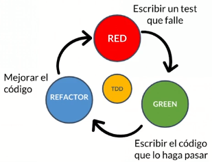

# Introduction-Testing-Java
Repositorio dedicado al manejo de pruebas en el lenguaje de programación Java.

Para poder llevar a cabo un test se debe de realizar lo siguiente:
1. Se deben de incluir las librerías que permiten trabajar con pruebas unitarias y de integración, tales y como lo son `JUnit` y `Mockito`. Estas deben ser dependencias agregadas al archivo **`pom.xml`** de la siguiente forma:

```xml
<dependencies>
    <dependency>
        <groupId>junit</groupId>
        <artifactId>junit</artifactId>
        <version>4.12</version>
        <scope>test</scope>
    </dependency>
    <dependency>
        <groupId>org.hamcrest</groupId>
        <artifactId>hamcrest-core</artifactId>
        <version>1.3</version>
        <scope>test</scope>
    </dependency>
    <dependency>
        <groupId>org.mockito</groupId>
        <artifactId>mockito-core</artifactId>
        <version>3.9.0</version>
        <scope>test</scope>
    </dependency>
</dependencies>
```
> Nota: Maven se encarga de descargar e instalar las librerias correspondientes.

2. Se debe de crear una clase con el funcionamiento de alguna tarea que se quiera probar. Para este ejemplo usamos dos clases para jugar a los dados, situados en el `package` **Player**. 

3. En el IDE de **Netbeans** vienen integradas una serie de herramientas para trabajar con pruebas: Para abrir una clase de test basta con colocarnos en el nombre de la clase y presionar **`Alt + Enter`**, para posteriormente escoger `JUnit`.

4. Posteriormente, generamos los metodos que van a probar cada una de las pruebas unitarias, automaticas o manuales. 

```java
package player;

import static org.junit.Assert.*;
import org.junit.Test;
import org.mockito.Mockito;

/**
 *
 * @author Jesus Diaz
 */
public class PlayerTest {

    public PlayerTest() {
    }

    @Test
    public void losses_when_dice_number_is_too_low() {
        Dice dice = Mockito.mock(Dice.class);
        Mockito.when(dice.roll()).thenReturn(2);
        
        Player player = new Player(dice, 3);
        assertFalse(player.play());
    }
    
    @Test
    public void wins_when_dice_number_is_big() {
        Dice dice = Mockito.mock(Dice.class);
        Mockito.when(dice.roll()).thenReturn(5);
        
        Player player = new Player(dice, 3);
        assertTrue(player.play());
    }
}
 ```

> Nota 2: Arriba de cada metodo se debe de establecer la notacion de **`@Test`** para especificarle al IDE que debe ejecutarlo como una prueba.
> 
> Nota 3: **`Mockito`** permite simular el comportamiento de una clase de forma dinámica, sin necesidad de crearla directamente.

## TDD
* Desarrollo guiado por tests
* Creado por Kent Beck
* Comenzando escribiendo test nos ayuda a pensar el diseño
* Al terminar tendremos los tes con sus beneficios

### Ciclo del TDD



#### 3 reglas del TDD
1. Sólo escribirás código del test hasta que falle
2. Sólo escribirás código de producción si es para pasar un test que falla
3. No escribirás más código de producción del necesario para pasar el test


